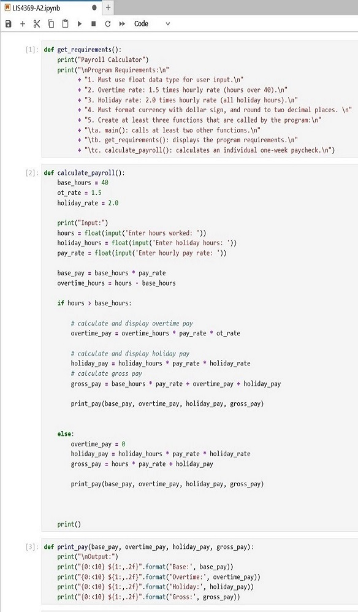

> **NOTE:** This README.md file should be placed at the **root of each of your repos directories.**
>
>Also, this file **must** use Markdown syntax, and provide project documentation as per below--otherwise, points **will** be deducted.
>

# LIS4369

## Anthony Patregnani

### Assignment 2 Requirements:

*Sub-Heading:*

1. Backwards Engineer Python Program
2. Use Jupyter Notebook/labs to display program
3. Provide Screenshots of installation

#### README.md file should include the following items:

* Screenshot of Assignment 2 application running
* Link to A2 .ipynb file: [LIS4369-A2.ipynb](LIS4369-A2.ipynb "A2 Jupyter Notebook") 

> This is a blockquote.
> 
> This is the second paragraph in the blockquote.
>

#### Assignment Screenshots:

| *Screenshot of Jupyter Notebook running http://localhost*:  |   | *Screenshot of Jupyter Notebook running http://localhost*:  |   |   |
|---|---|---|---|---|
|   |   |    |   |   |

| *Screenshot of Payroll Calc w/ overtime*: |   |  *Screenshot of Payroll Calc w/o overtime*: |   |   |
|---|---|---|---|---|
|   |   |   |   |   |

