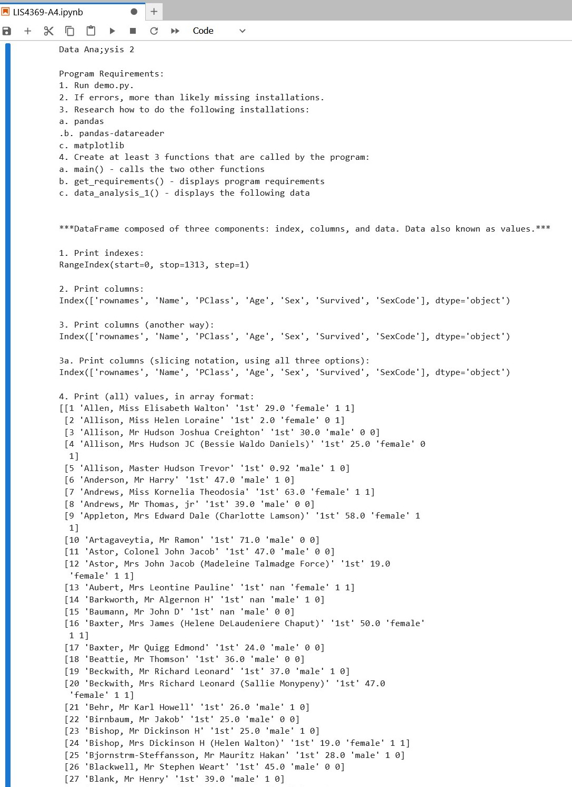
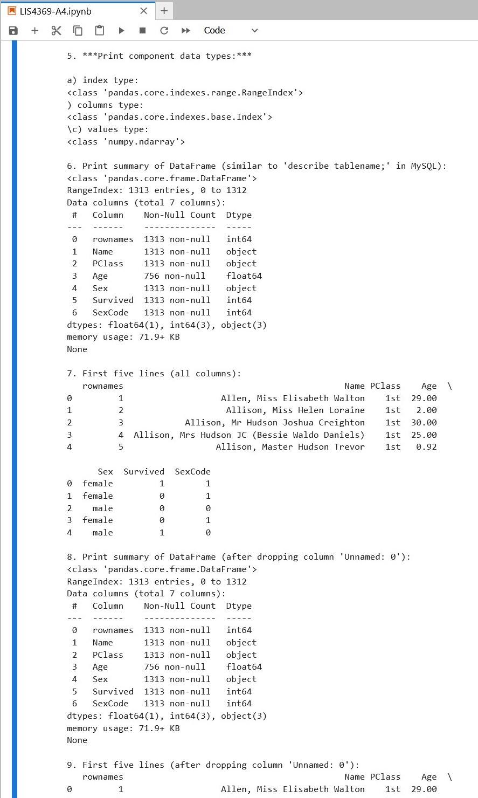
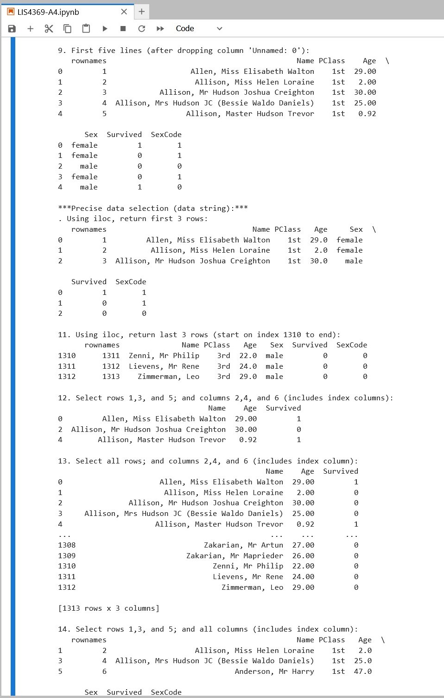
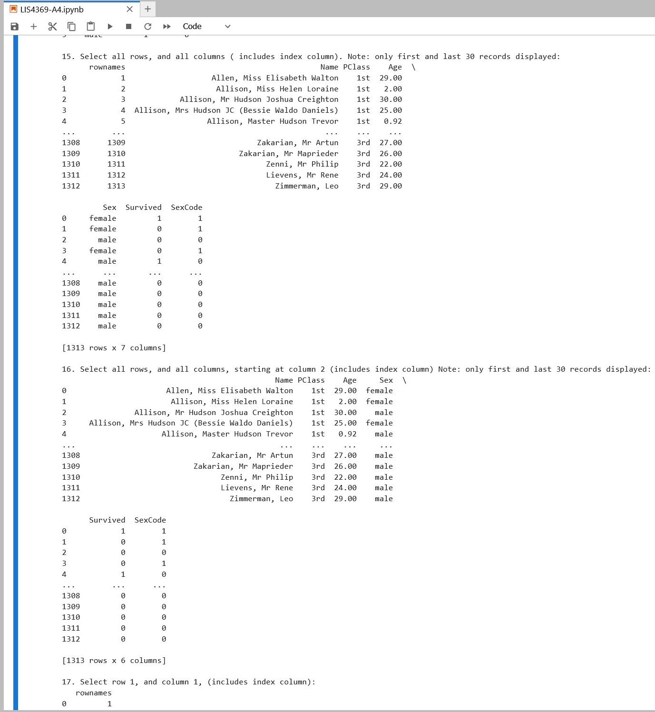
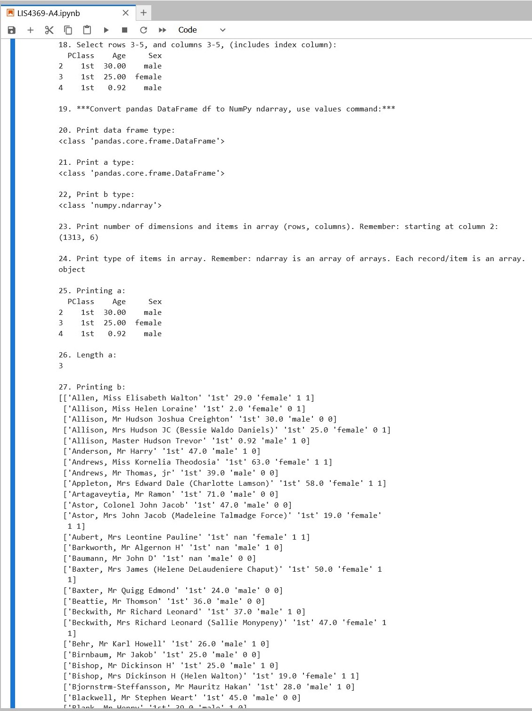
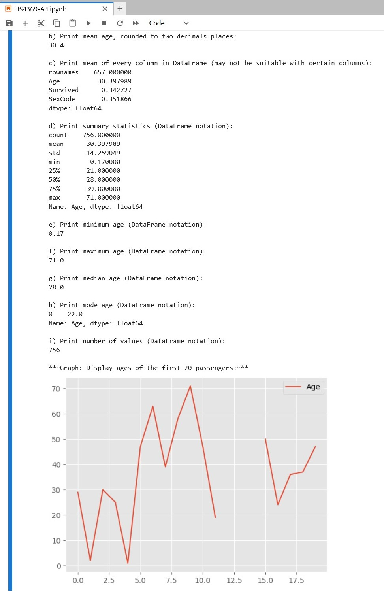
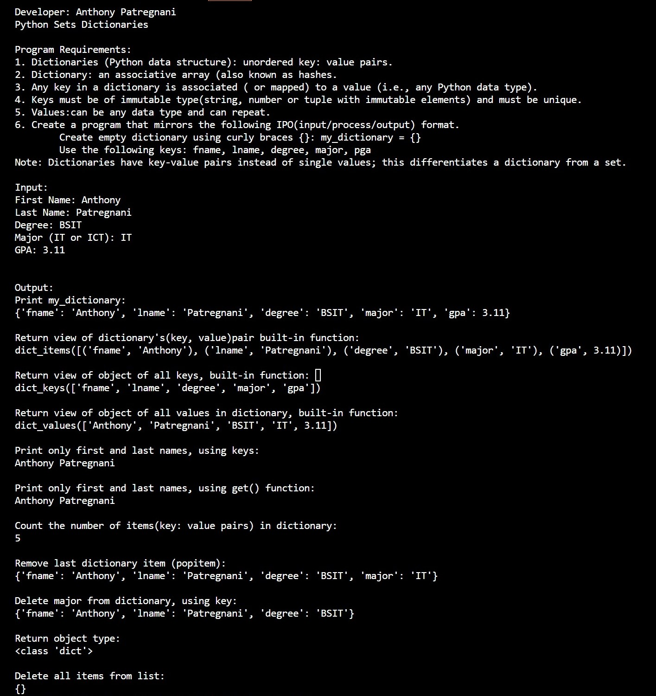
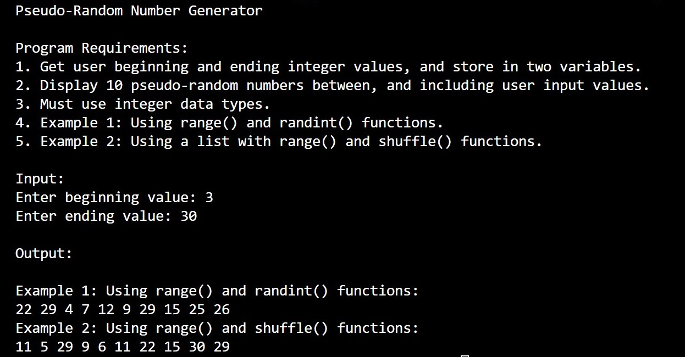
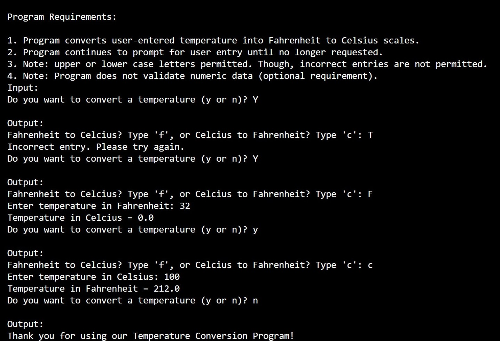

> **NOTE:** This README.md file should be placed at the **root of each of your repos directories.**
>
>Also, this file **must** use Markdown syntax, and provide project documentation as per below--otherwise, points **will** be deducted.
>

# LIS4969

## Anthony Patregnani

### Assignment 4 Requirements:

*Sub-Heading:*

1. Backwards Engineer Python Program
2. Use Jupyter Notebook/labs to display program
3. Provide Screenshots of installation

#### README.md file should include the following items:

* Screenshot of Assignment 4 application running
* Link to A4 .ipynb file: [LIS4369-A4.ipynb](LIS4369-A4.ipynb "A4 Jupyter Notebook") 

#### Assignment 4 Screenshots:

| *Screenshot of Jupyter Notebook running http://localhost*:  |  *Screenshot of Jupyter Notebook running http://localhost*: | *Screenshot of Jupyter Notebook running http://localhost*:  |   |   |   |
|---|---|---|---|---|---|
|   |   |   |   |   |   |

| *Screenshot of Jupyter Notebook running http://localhost*:  | *Screenshot of Jupyter Notebook running http://localhost*:  |  *Screenshot of Jupyter Notebook running http://localhost*: |   |   |
|---|---|---|---|---|
|   |   |   |   |   |

| *Screenshot of running Skillset10*:  |   | *Screenshot of running Skillset11*:  |   | *Screenshot of running Skillset12*:  |
|---|---|---|---|---|
|   |   |   |   |   |
