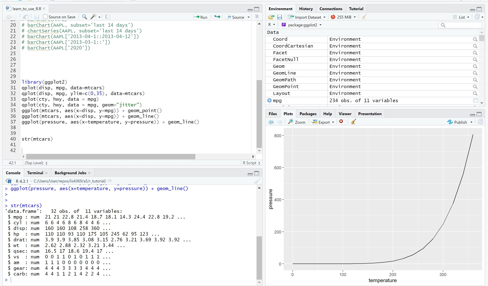
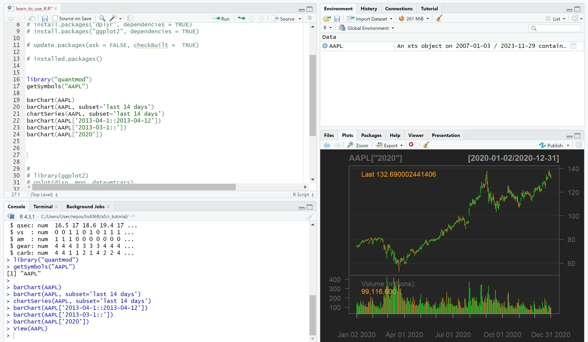
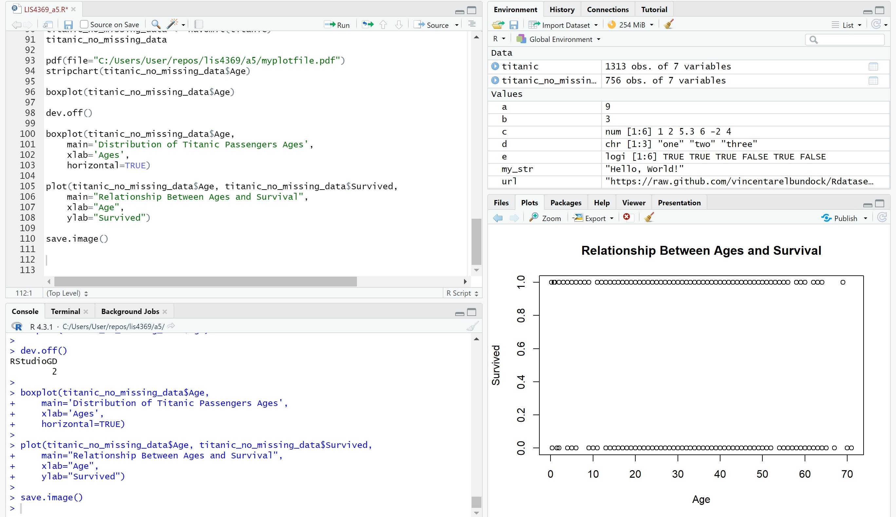
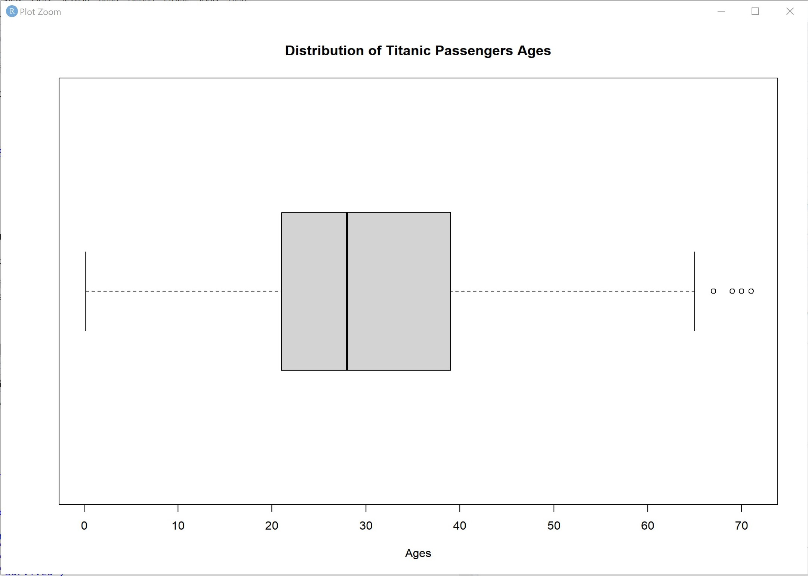
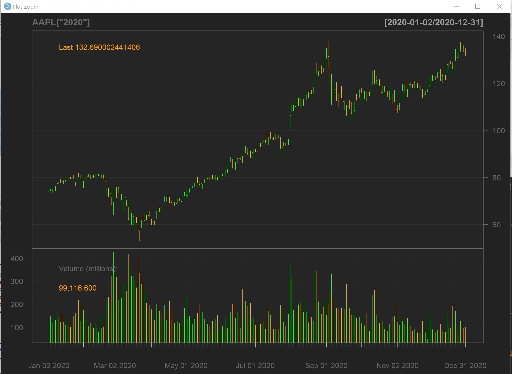
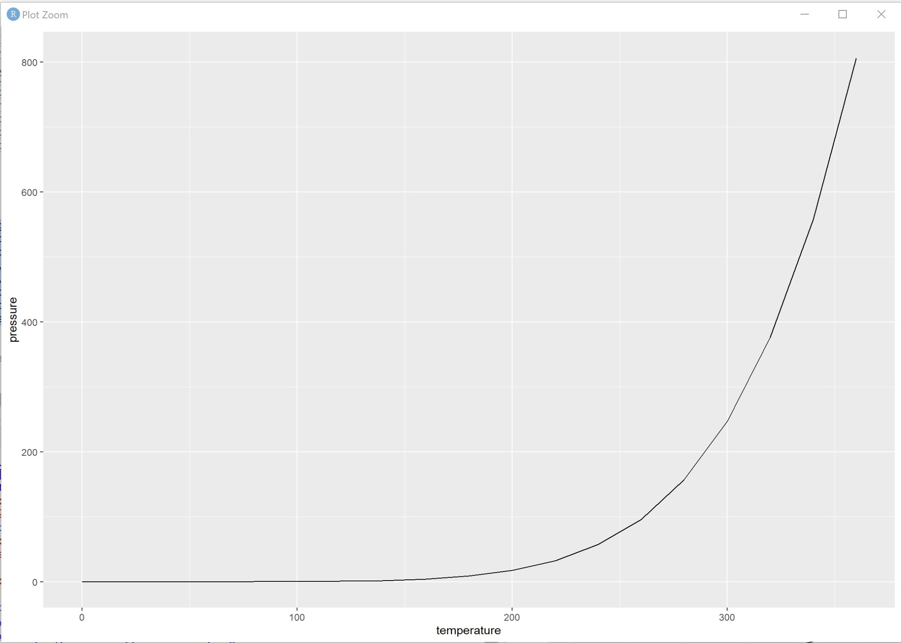
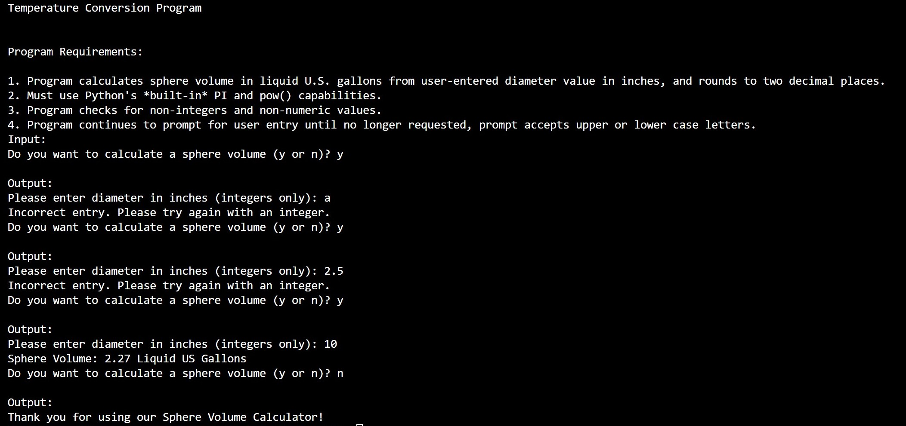
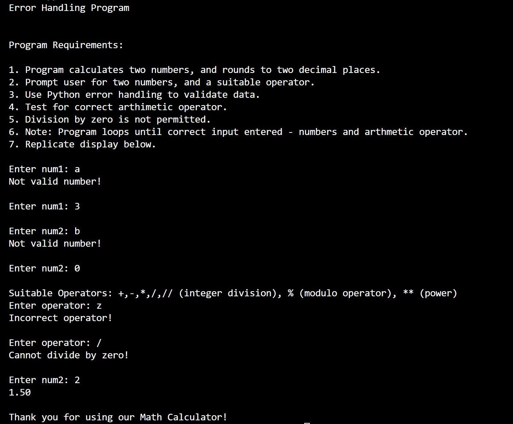
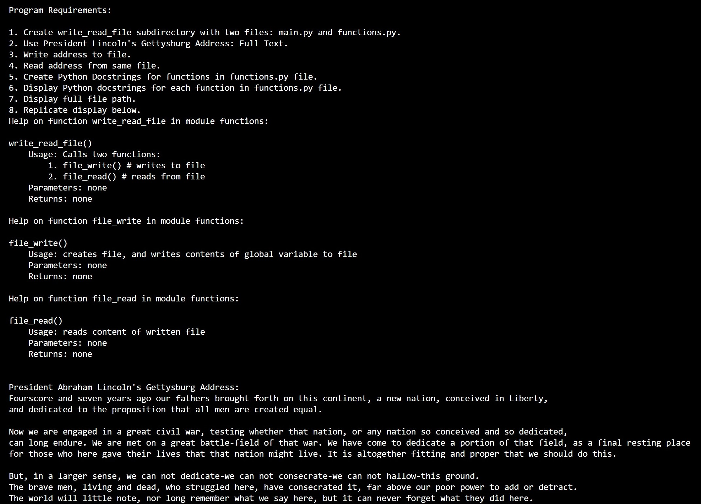

> **NOTE:** This README.md file should be placed at the **root of each of your repos directories.**
>
>Also, this file **must** use Markdown syntax, and provide project documentation as per below--otherwise, points **will** be deducted.
>

# LIS4930

## Anthony Patregnani

### Assignment 5 Requirements:

*Sub-Heading:*

1. Backwards Engineer Python Program
2. Use RStudio to display program
3. Provide Screenshots of installation

#### Assignment 5 Screenshots:

*Screenshot of RStudio Tutorial 4-Panel*:

*Screenshot of RStudio Tutorial 4-Panel #2*:

*Screenshot of RStudio A5 4-Panel*:

*Screenshot of RStudio A5 4-Panel*:

*Screenshot of RStudio A5 Plot*:

*Screenshot of RStudio A5 Plot - 2*:

*Screenshot of RStudio tutorial Plot*:

*Screenshot of RStudio tutorial Plot*:

| *Screenshot of running Skillset13*:  |   | *Screenshot of running Skillset14*:  |   | *Screenshot of running Skillset15*:  |
|---|---|---|---|---|
|   |   |   |   |   |

