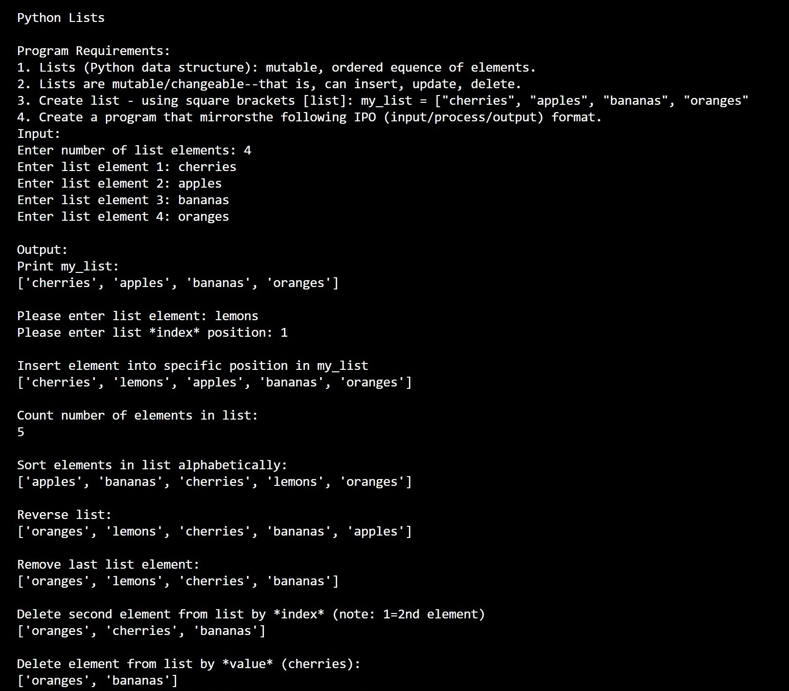
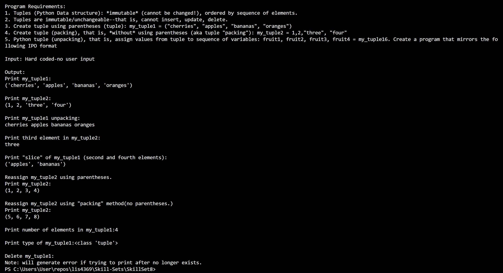

> **NOTE:** This README.md file should be placed at the **root of each of your repos directories.**
>
>Also, this file **must** use Markdown syntax, and provide project documentation as per below--otherwise, points **will** be deducted.
>

# LIS4930

## Anthony Patregnani

### Project 1 Requirements:

*Sub-Heading:*

1. Backwards Engineer Python Program
2. Use Jupyter Notebook/labs to display program
3. Provide Screenshots of installation

#### README.md file should include the following items:

* Screenshot of Project 1 application running
* Link to P1 .ipynb file: [lis4369-P1.ipynb](LIS4369-P1.ipynb "P1 Jupyter Notebook") 

#### Project 1 Screenshots:

*Screenshot of Jupyter Notebook running http://localhost*:

| *Screenshot of running Skillset7*:  |   | *Screenshot of running Skillset8*:  |   | *Screenshot of running Skillset9*:  |
|---|---|---|---|---|
|   |   |   |   |   |

