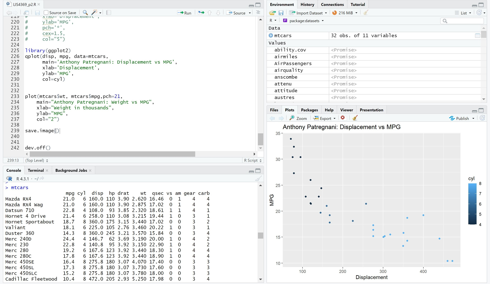
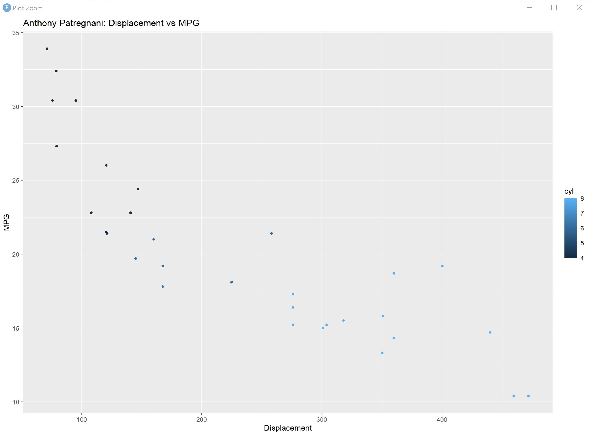
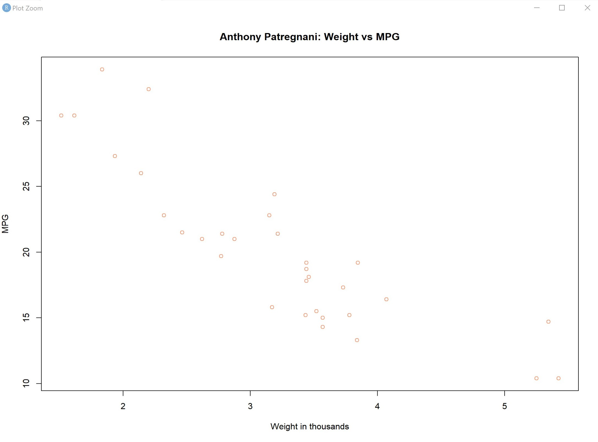

> **NOTE:** This README.md file should be placed at the **root of each of your repos directories.**
>
>Also, this file **must** use Markdown syntax, and provide project documentation as per below--otherwise, points **will** be deducted.
>

# LIS4369

## Anthony Patregnani

### Project 2 Requirements:

*Sub-Heading:*

1. Backwards Engineer Python Program
2. Use RStudio to display program
3. Provide Screenshots of installation

#### Project 2 Screenshots:

*Screenshot of RStudio P2 4-Panel*:

| *Screenshot of Displacement vs MPG*:  |  *Screenshot of Weight vs MPG*: |
|---|---|
|   |   |

